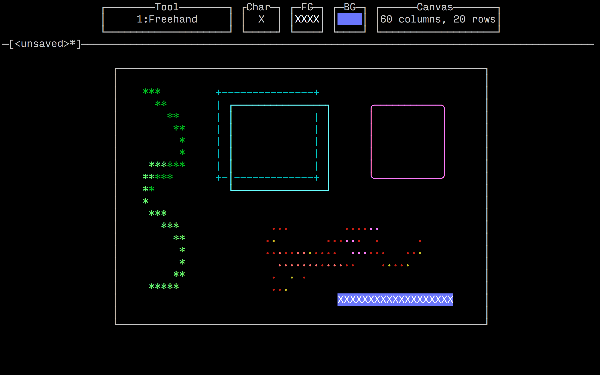

tart - terminal art program
===========================

```
 _____  _    ____ _____  _
(_   _)/ \  |    (_   _)| |
  | | / ^ \ |  O  || |  |_|
  | |/ ___ \|  _ < | |   _
  |_|_/   \_|_| \_\|_|  |_|
```

Tart is a program that provides an image-editor-like interface to
creating ASCII art.



How It Works
============

Tart requires a terminal with mouse support. You use various tools (such
as freehand drawing, boxes, etc.) to draw ASCII pictures. You can set a
current foreground and background color. You can also resize the drawing
canvas to get the desired output size. When you're finished, you can
save to disk, at which point Tart creates three files:

 * A binary file (say `foo`) suitable for reloading with Tart for
   further editing later
 * A text file `foo.color.txt` containing the ASCII art with terminal
   color escape sequences, suitable for emitting to terminals
 * A text file `foo.plain.txt` containing the ASCII art without terminal
   color escape sequences, suitable for embedding in documentation
